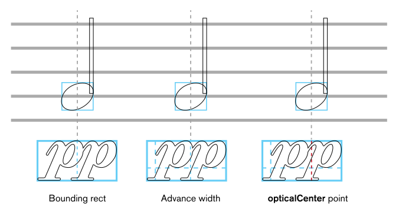

Aligning dynamics with noteheads and stems
------------------------------------------

The opticalCenter point is defined for glyphs that are normally centered
on a notehead or stem, such as dynamics. There are a number of possible
approaches to centering a dynamic, which are illustrated in the figure
below:

-   The horizontal grey lines denote staff lines, for scale.

-   The light blue boxes show glyph bounding boxes.

-   The intersecting vertical and horizontal dashed light blue lines
    show the glyph origin relative to its bounding box.

-   The vertical dashed grey lines denote the center of the notehead,
    the point against which the dynamics should be aligned.

-   The vertical dashed red line shows the position of the opticalCenter
    point, as specified in the font metadata JSON file.

The figure shows that centering the dynamic by determining the bounding
rectangle and using half its width is least satisfactory, while using
half the advance width is an acceptable default in the absence of a
specific optical center position determined by the font designer.

The opticalCenter point can be set by the font designer to provide a
very specific balancing point, relative to e.g. the bowl of the italic &#xE520;
or the curve at the top of the italic &#xE522;.
